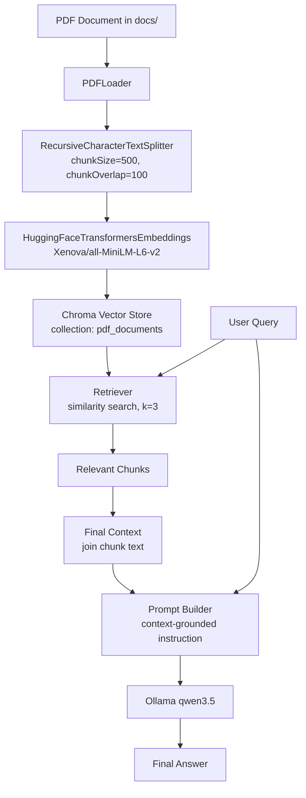

# GenAI and Agentic AI Learnings

A TypeScript project for exploring generative AI and agentic AI concepts, including RAG (Retrieval-Augmented Generation) pipelines with LangChain.js.

## Recent Changes

- Added end-to-end `src/rag-pipeline.ts` flow: PDF load, split, embed, store, retrieve, and answer generation.
- Added similarity retrieval (`k=3`) with user query input from CLI.
- Added grounded prompt generation using retrieved context and Ollama `qwen3.5`.
- Added npm scripts: `rag`, `rag:dev`, and `chroma`.
- Added a Mermaid RAG pipeline diagram under the RAG section.

## Getting Started

### Prerequisites
- Node.js (v16 or higher)
- npm (v7 or higher)
- Python 3.9+ (for Chroma vector database server)

### Installation

```bash
npm install
```

Install the Chroma server (one-time):
```bash
pip3 install chromadb
```

---

## Project Structure
```
src/
  index.ts          - Ollama LLM connection test
  rag-pipeline.ts   - Full RAG pipeline (PDF → Chunks → Embeddings → Chroma → Query)
dist/               - Compiled JavaScript output
docs/               - Source documents (PDFs)
db/                 - Chroma vector database persistence
tsconfig.json       - TypeScript configuration
package.json        - Project dependencies and scripts
```

---

## Scripts

| Command | Description |
|---------|-------------|
| `npm run build` | Compile TypeScript to JavaScript |
| `npm run dev` | Run `index.ts` directly via ts-node |
| `npm start` | Run compiled `index.js` |
| `npm run rag` | Run compiled RAG pipeline |
| `npm run rag:dev` | Run RAG pipeline directly via ts-node (no build needed) |
| `npm run chroma` | Start the Chroma vector database server |
| `npm run clean` | Remove compiled `dist/` output |

---

## RAG Pipeline

The RAG pipeline (`src/rag-pipeline.ts`) implements the following steps:

1. **Load PDF** — Loads a PDF document using `PDFLoader`
2. **Split** — Splits pages into chunks (`chunkSize: 500`, `chunkOverlap: 100`) using `RecursiveCharacterTextSplitter`
3. **Embed** — Generates embeddings using `HuggingFaceTransformersEmbeddings` (`Xenova/all-MiniLM-L6-v2`)
4. **Store** — Persists vectors in a local Chroma collection (`pdf_documents`)
5. **Query** — Takes user input, runs similarity search (`k=3`), and returns the top 3 relevant chunks
6. **Generate** — Builds a context string from retrieved chunks, constructs a grounded prompt, and calls the Ollama `qwen3.5` model for a response. If context is not aligned with the query, the model replies with `'No context found'`.

### RAG Flow Diagram



### Running the RAG Pipeline

### Quick Run Flow (Recommended)

Use 3 terminals in this exact order:

**Terminal 1 — Ollama**
```bash
ollama serve
```

**Terminal 2 — Chroma**
```bash
npm run chroma
```

**Terminal 3 — RAG app**
```bash
npm run build && npm run rag
```

For faster iteration (no compile step):
```bash
npm run rag:dev
```

**Step 1 — Start Ollama** (if not already running):
```bash
ollama serve
ollama pull qwen3.5
```

**Step 2 — Start Chroma server** (in a separate terminal):
```bash
npm run chroma
```

**Step 3 — Run the pipeline** (in another terminal):
```bash
npm run build && npm run rag
```

Or without building:
```bash
npm run rag:dev
```

### Dependencies

| Python Package | npm Package | Purpose |
|---------------|-------------|---------|
| `langchain_community.PyPDFLoader` | `@langchain/community` | PDF loading |
| `langchain_text_splitters` | `@langchain/textsplitters` | Document chunking |
| `langchain_huggingface.HuggingFaceEmbeddings` | `@langchain/community/embeddings/huggingface_transformers` | Embeddings |
| `langchain_chroma.Chroma` | `@langchain/community/vectorstores/chroma` + `chromadb` | Vector store |

### Troubleshooting

- If you see `Cannot find package '@huggingface/transformers'` while running `npm run rag` or `npm run rag:dev`, install it with:

```bash
npm install @huggingface/transformers --legacy-peer-deps
```

---

## Ollama LLM Test (`src/index.ts`)

Tests a local Ollama connection using the `qwen3.5` model.

### Prerequisites
```bash
ollama serve
ollama pull qwen3.5
```

### Run
```bash
npm run dev
```

---

## License

ISC
