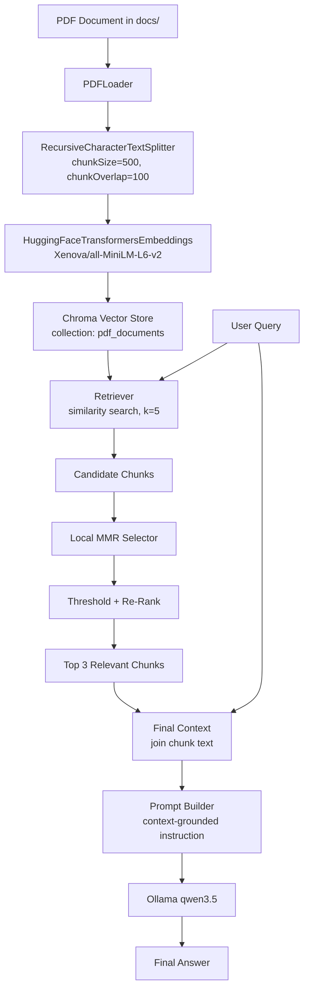

# GenAI and Agentic AI Learnings

A TypeScript project for exploring generative AI and agentic AI concepts, including RAG (Retrieval-Augmented Generation) pipelines with LangChain.js.

## Recent Changes

- Added end-to-end `src/rag-pipeline.ts` flow: PDF load, split, embed, store, retrieve, and answer generation.
- Added similarity retrieval (`k=5`) with local embedding-based reranking to keep the top 3 chunks.
- Added an MMR-style retrieval example that uses similarity fetch followed by local MMR selection for more diverse chunk selection.
- Added grounded prompt generation using retrieved context and Ollama `qwen3.5`.
- Added npm scripts: `rag`, `rag:dev`, and `chroma`.
- Added a Mermaid RAG pipeline diagram under the RAG section.
- Added local embedding-based reranking so the pipeline does not depend on downloading a reranker model.
- Added hybrid retrieval with `EnsembleRetriever` (BM25 sparse + Chroma dense) using weighted RRF.
- Added persistent query-response cache for `ensemble` mode (`db/query-response-cache.json`) with TTL.

## Getting Started

### Prerequisites
- Node.js (v16 or higher)
- npm (v7 or higher)
- Python 3.9+ (for Chroma vector database server)

### Installation

```bash
npm install
```

Create environment file:

```bash
cp .env.example .env
```

Install the Chroma server (one-time):
```bash
pip3 install chromadb
```

---

## Project Structure
```
src/
  index.ts          - Ollama LLM connection test
  rag-pipeline.ts   - Full RAG pipeline (PDF → Chunks → Embeddings → Chroma → Query)
dist/               - Compiled JavaScript output
docs/               - Source documents (PDFs)
db/                 - Chroma vector database persistence
tsconfig.json       - TypeScript configuration
package.json        - Project dependencies and scripts
```

---

## Scripts

| Command | Description |
|---------|-------------|
| `npm run build` | Compile TypeScript to JavaScript |
| `npm run dev` | Run `index.ts` directly via ts-node |
| `npm start` | Run compiled `index.js` |
| `npm run rag` | Run compiled RAG pipeline |
| `npm run rag:dev` | Run RAG pipeline directly via ts-node (no build needed) |
| `npm run rag:similarity` | Run compiled RAG pipeline with `similarity` retrieval |
| `npm run rag:mmr` | Run compiled RAG pipeline with `mmr` retrieval |
| `npm run rag:ensemble` | Run compiled RAG pipeline with `ensemble` retrieval |
| `npm run rag:dev:similarity` | Run ts-node RAG pipeline with `similarity` retrieval |
| `npm run rag:dev:mmr` | Run ts-node RAG pipeline with `mmr` retrieval |
| `npm run rag:dev:ensemble` | Run ts-node RAG pipeline with `ensemble` retrieval |
| `npm run eval:dialogsum` | Run compiled DialogSum evaluation |
| `npm run eval:dialogsum:dev` | Run DialogSum evaluation via ts-node |
| `npm run chroma` | Start the Chroma vector database server |
| `npm run clean` | Remove compiled `dist/` output |

---

## DialogSum Evaluation

Run summarization evaluation on 5 samples from `knkarthick/dialogsum` using Groq generation and compute BLEU, ROUGE, and BERTScore.

```bash
npm run eval:dialogsum:dev
```

Optional environment variables:

- `LLM_PROVIDER` (default: `groq`, options: `groq` or `azure`)
- `GROQ_API_KEY` (required when `LLM_PROVIDER=groq`)
- `GROQ_MODEL` (default: `llama-3.3-70b-versatile`, used for `groq`)
- `AZURE_API_KEY` or `AZURE_OPENAI_API_KEY` (required when `LLM_PROVIDER=azure`)
- `AZURE_OPENAI_DEPLOYMENT` (required when `LLM_PROVIDER=azure`)
- `AZURE_OPENAI_BASE_URL` or `AZURE_OPENAI_ENDPOINT` (required when `LLM_PROVIDER=azure`)
- `DIALOGSUM_CONFIG` (default: `default`)
- `DIALOGSUM_SPLIT` (default: `test`)
- `DIALOGSUM_OFFSET` (default: `0`)
- `DIALOGSUM_SAMPLE_SIZE` (default: `5`)
- `BERT_MODEL` (default: `Xenova/all-MiniLM-L6-v2`)
- `EVAL_OUTPUT_PATH` (default: `db/dialogsum-eval-results.json`)

### LLM Provider Toggle (Groq / Azure)

Use `.env` to switch providers without code changes:

```env
LLM_PROVIDER=groq
GROQ_API_KEY=...
GROQ_MODEL=llama-3.3-70b-versatile
```

```env
LLM_PROVIDER=azure
AZURE_API_KEY=...
AZURE_OPENAI_DEPLOYMENT=gpt-5.4-mini
AZURE_OPENAI_BASE_URL=https://<resource>.openai.azure.com/openai/v1
```

The script prints per-sample and aggregate metrics and stores full results in `db/dialogsum-eval-results.json`.

---

## RAG Pipeline

The RAG pipeline (`src/rag-pipeline.ts`) implements the following steps:

1. **Load PDF** — Loads a PDF document using `PDFLoader`
2. **Split** — Splits pages into chunks (`chunkSize: 500`, `chunkOverlap: 100`) using `RecursiveCharacterTextSplitter`
3. **Embed** — Generates embeddings using `HuggingFaceTransformersEmbeddings` (`Xenova/all-MiniLM-L6-v2`)
4. **Store** — Persists vectors in a local Chroma collection (`pdf_documents`)
5. **Query** — Takes user input and retrieves candidate chunks using one of:
  - `similarity` (dense-only)
  - `mmr` (similarity fetch + local MMR selection)
  - `ensemble` (BM25 + dense retriever fused with weighted RRF)
  Then reranks candidates with local embedding similarity and keeps the top chunks.
6. **Generate** — Builds a context string from retrieved chunks, constructs a grounded prompt, and calls the Ollama `qwen3.5` model for a response. If context is not aligned with the query, the model replies with `'No context found'`.
  - The pipeline sets `think: false` for Ollama to limit verbose reasoning output and return concise final answers.
  - The reranker uses local embedding similarity scoring, so no external reranker download is required.
7. **Cache (Ensemble mode)** — For repeated queries in `ensemble` mode, the pipeline checks a query-response cache first and returns cached responses immediately when available.

### MMR Retrieval Example

The pipeline also includes an MMR-style mode for more diverse retrieval results. Because Chroma does not support native MMR in this setup, the pipeline fetches candidates with similarity search and then applies local MMR selection in TypeScript.

```typescript
const retriever = vectorStore.asRetriever({
  searchType: "similarity",
  k: 20,
});

// then apply local MMR selection with lambda = 0.5 and topK = 5
```

- The initial similarity fetch gets candidate chunks.
- Local MMR selection then balances relevance versus diversity.
- `lambda` balances relevance versus diversity.

### Ensemble Retriever Example (Hybrid Search)

The pipeline also supports a hybrid retriever equivalent to your Python snippet using:

- `BM25Retriever` for sparse keyword retrieval
- Chroma retriever for dense semantic retrieval
- `EnsembleRetriever` for weighted RRF fusion

Current example in code:

```typescript
const bm25Retriever = BM25Retriever.fromDocuments(chunks, { k: 5 });
const denseRetriever = vectorStore.asRetriever({ searchType: "similarity", k: 5 });

const ensembleRetriever = new EnsembleRetriever({
  retrievers: [bm25Retriever, denseRetriever],
  weights: [0.3, 0.7],
});

const docs = await ensembleRetriever.invoke(userQuery);
```

This mirrors the Python `EnsembleRetriever` pattern and gives a hybrid blend of lexical and semantic matching.

### Query-Response Cache

- Cache is enabled for `ensemble` mode.
- Cache key format: `retrievalMode + normalizedQuery`.
- Cache file: `db/query-response-cache.json`.
- TTL: 24 hours.

Behavior:

- Cache hit: skips retrieval + rerank + model call and returns stored response.
- Cache miss: runs full pipeline and saves response to cache.

### RAG Flow Diagram



### Threshold Tuning Example

The pipeline now shows two separate thresholding stages for better retrieval quality:

1. **`similarity_score_threshold`** — filters the initial candidate chunks before reranking.
2. **`score_threshold`** — filters reranked chunks before they are passed into the final prompt.

Current example values in code:

```typescript
const SIMILARITY_SCORE_THRESHOLD = 0.25;
const RERANK_SCORE_THRESHOLD = 0.20;
```

Example flow:

```text
Similarity search (k=5)
→ apply similarity_score_threshold
→ rerank by embedding similarity
→ apply score_threshold
→ take top 3 chunks
→ generate final answer
```

### Running the RAG Pipeline

### Pass Retrieval Mode

You can pass retrieval mode at runtime (instead of changing code):

- Environment variable: `RETRIEVAL_MODE=similarity|mmr|ensemble`
- CLI flag: `--retrieval-mode=similarity|mmr|ensemble` (or `--mode=...`)

Examples:

```bash
RETRIEVAL_MODE=similarity npm run rag:dev
RETRIEVAL_MODE=mmr npm run rag:dev
RETRIEVAL_MODE=ensemble npm run rag:dev
```

```bash
npm run rag:dev -- --retrieval-mode=mmr
npm run rag:dev -- --mode=ensemble
```

Priority order is: CLI flag > environment variable > default (`ensemble`).

Shortcut scripts:

```bash
npm run rag:dev:similarity
npm run rag:dev:mmr
npm run rag:dev:ensemble
```

### Quick Run Flow (Recommended)

Use 3 terminals in this exact order:

**Terminal 1 — Ollama**
```bash
ollama serve
```

**Terminal 2 — Chroma**
```bash
npm run chroma
```

**Terminal 3 — RAG app**
```bash
npm run build && npm run rag
```

For faster iteration (no compile step):
```bash
npm run rag:dev
```

**Step 1 — Start Ollama** (if not already running):
```bash
ollama serve
ollama pull qwen3.5
```

**Step 2 — Start Chroma server** (in a separate terminal):
```bash
npm run chroma
```

**Step 3 — Run the pipeline** (in another terminal):
```bash
npm run build && npm run rag
```

Or without building:
```bash
npm run rag:dev
```

### Dependencies

| Python Package | npm Package | Purpose |
|---------------|-------------|---------|
| `langchain_community.PyPDFLoader` | `@langchain/community` | PDF loading |
| `langchain_text_splitters` | `@langchain/textsplitters` | Document chunking |
| `langchain_huggingface.HuggingFaceEmbeddings` | `@langchain/community/embeddings/huggingface_transformers` | Embeddings |
| `langchain_chroma.Chroma` | `@langchain/community/vectorstores/chroma` + `chromadb` | Vector store |
| `langchain_community.retrievers.BM25Retriever` | `@langchain/community/retrievers/bm25` | Sparse retrieval |
| `langchain.retrievers.EnsembleRetriever` | `@langchain/classic/retrievers/ensemble` | Hybrid weighted RRF fusion |

### Troubleshooting

- If Chroma is not running, start it with `npm run chroma` before running the RAG pipeline.
- If Ollama is not running, start it with `ollama serve` and make sure the `qwen3.5` model is available.

---

## Ollama LLM Test (`src/index.ts`)

Tests a local Ollama connection using the `qwen3.5` model.

### Prerequisites
```bash
ollama serve
ollama pull qwen3.5
```

### Run
```bash
npm run dev
```

---

## License

ISC
