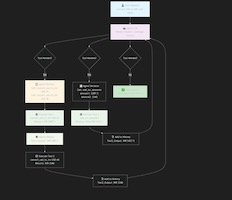

# Sequential Tool Calling in LangChain Agents

## Overview

Sequential tool calling is a pattern where an AI agent calls one tool, receives its output, and then uses that output to inform decisions about which tool to call next. This is different from parallel tool calling, where multiple tools are called simultaneously.

## How It Works

### The Flow

```
User Request
    ↓
Agent LLM (reads user request + previous tool outputs)
    ↓
Decides which tool to call next
    ↓
Tool Executes → Output Generated
    ↓
Tool Output Added to Message History
    ↓
LLM Reads Output and Decides Next Action
    ↓
Either:
  • Call another tool (loop back)
  • Provide final answer (stop)
```

#### Visual Diagram



## Key Concepts

### 1. **Message History / State**
The `MessagesAnnotation.State` maintains a conversation history that includes:
- User messages
- Agent's tool-call decisions (with arguments)
- Tool execution results

The LLM can see all previous tool outputs when making the next decision.

### 2. **StateGraph with Loop-Back**
```typescript
const graph = new StateGraph(MessagesAnnotation)
  .addNode("agent", callModel)        // LLM decides which tool to call
  .addNode("tools", callTools)        // Execute the tool
  .addEdge(START, "agent")            // Start at agent
  .addConditionalEdges("agent", shouldContinue, { 
    tools: "tools",                   // If tool needed → execute
    [END]: END 
  })
  .addEdge("tools", "agent")          // After tool → back to agent
  .compile();
```

The feedback loop (`"tools" → "agent"`) is critical—it allows the agent to see tool outputs and make the next decision.

### 3. **Sequential Tool Processing**
In `callTools()` function, tools are called in a **for loop** (not Promise.all):
```typescript
for (const tc of toolCalls) {
  const output = await selectedTool.invoke(tc.args);
  results.push(new ToolMessage({
    tool_call_id: tc.id ?? "",
    content: String(output),
  }));
}
```

This ensures tools execute in order, and the LLM sees each result before the next tool is called.

## Example: USD to INR Conversion

### Scenario
Convert two USD transactions ($25, $40) to INR, then add the totals.

### Execution Sequence

**Step 1:** Agent reads request
```
User: "Convert $25 and $40 to INR, then add them"
```

**Step 2:** Agent decides → Call Tool 1 (convert_usd_to_inr)
```
Tool Call 1: convert_usd_to_inr(usd: 25)
Tool Call 2: convert_usd_to_inr(usd: 40)
```

**Step 3:** Tools execute, results added to history
```
Tool 1 Output: { inr: 2087.5 }
Tool 2 Output: { inr: 3340 }
```

**Step 4:** Agent reads outputs, decides → Call Tool 2 (add_inr_amounts)
```
Tool Call 3: add_inr_amounts(amount1: 2087.5, amount2: 3340)
```

**Step 5:** Tool executes
```
Tool 3 Output: { totalInr: 5427.5 }
```

**Step 6:** No more tool calls needed → Agent provides final answer
```
"The total is 5427.5 INR"
```

## Why Sequential Matters

### ✅ Advantages
- **Data Dependencies**: Tool B needs output from Tool A
- **Reasoning**: Agent can adjust decisions based on intermediate results
- **Debugging**: Easier to trace tool execution order
- **Precision**: One tool at a time, no race conditions

### ⚠️ When NOT to Use Sequential
- Tools are independent (use parallel instead for speed)
- Need real-time responsiveness (sequential adds latency)

## Code Structure in `langchain-sequential-agent.ts`

```typescript
// 1. Define Tools
const convertUsdToInrTool = tool(...)
const addInrAmountsTool = tool(...)

// 2. Create LLM with Tools Bound
const llm = new ChatGroq({...}).bindTools([tool1, tool2])

// 3. Agent Node (decides which tool to call)
async function callModel(state) {
  const response = await llm.invoke(state.messages)
  return { messages: [response] }
}

// 4. Tools Node (executes tools sequentially)
async function callTools(state) {
  const toolCalls = lastMessage.tool_calls
  for (const tc of toolCalls) {
    const output = await toolMap[tc.name].invoke(tc.args)
    results.push(new ToolMessage({
      tool_call_id: tc.id,
      content: String(output),
    }))
  }
  return { messages: results }
}

// 5. Conditional Edge (loop back if more tools needed)
function shouldContinue(state) {
  return lastMessage.tool_calls?.length > 0 ? "tools" : END
}

// 6. Build Graph with Loop
const graph = new StateGraph(MessagesAnnotation)
  .addNode("agent", callModel)
  .addNode("tools", callTools)
  .addEdge(START, "agent")
  .addConditionalEdges("agent", shouldContinue, { tools: "tools", [END]: END })
  .addEdge("tools", "agent")  // ← Loop back!
  .compile()
```

## How to Run

```bash
npm run agent:sequential
```

This will execute two example scenarios showing sequential tool calling in action.

## Real-World Use Cases

1. **Data Processing Pipeline**
   - Extract data (Tool 1) → Transform data (Tool 2) → Validate data (Tool 3)

2. **Multi-Step Calculations**
   - Convert currency → Apply tax → Calculate total (like our example)

3. **Research Agent**
   - Search (Tool 1) → Summarize (Tool 2) → Verify facts (Tool 3)

4. **E-Commerce Checkout**
   - Validate inventory (Tool 1) → Calculate shipping (Tool 2) → Process payment (Tool 3)

5. **Content Creation**
   - Generate outline (Tool 1) → Write sections (Tool 2) → Proofread (Tool 3)

## Key Takeaway

Sequential tool calling empowers agents to:
1. **Reason** about intermediate results
2. **Adapt** their next steps based on previous outcomes
3. **Handle** complex workflows with dependencies
4. **Provide** transparent, auditable execution chains

This is the foundation for building sophisticated AI workflows! 🚀
