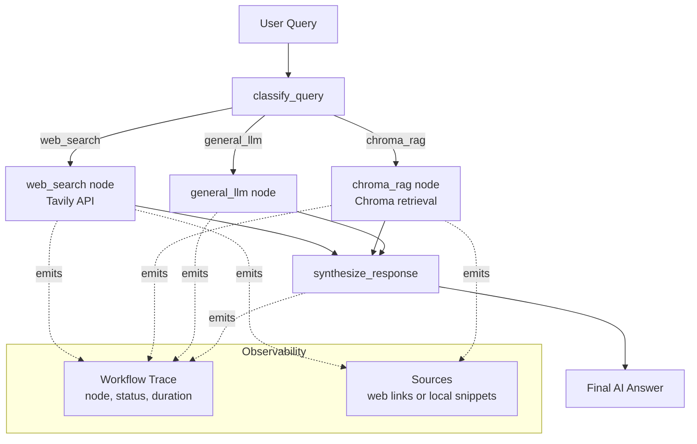

# AgenticRAG Example (LangGraph + Tavily + Chroma + LLM)

This is a separate example from the existing chatbot.

## What it does

- Uses a LangGraph router node to classify each query into one route:
  - `web_search` via Tavily for current/live info
  - `chroma_rag` for local docs retrieval from Chroma Vector DB
  - `general_llm` for generic reasoning/chat
- Uses a final `synthesize_response` node to generate the final answer.
- Returns workflow trace logs and source snippets to the UI.

## Workflow Diagram



## Run

1. Ensure `.env` contains:

```bash
GROQ_API_KEY=...
TAVILY_API_KEY=...
# Optional
LLM_PROVIDER=groq
CHROMA_URL=http://localhost:8000
CHROMA_COLLECTION=agentic_rag_docs
EMBEDDING_MODEL=Xenova/bge-m3
PORT=3100
```

2. Start Chroma server (separate terminal):

```bash
npm run chroma
```

3. Start this example:

```bash
npm run agentic:rag:web
```

4. Open:

```bash
http://localhost:3100/agentic-rag
```

## Notes

- Chroma indexing is lazy and runs on first query.
- Only `.txt` and `.md` files under `docs/` are indexed in this example.
- Workflow details are returned by `POST /api/chat`.
